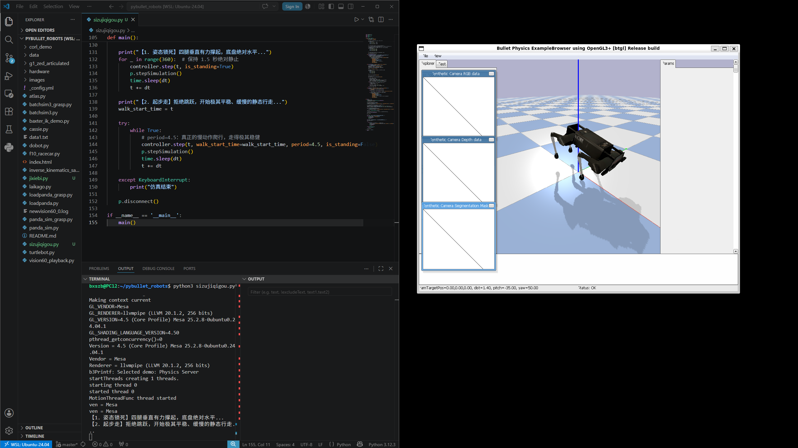

📝 AI Robotics 实验进度报告
姓名：王昕昊（Wang Xinhao） 学校：信韩大学 国际学院 软件专业（Shinhan University · International College · Software Engineering）🇰🇷 课程名称：Artificial Intelligence Robotics 实验日期：2026年5月28日

🇨🇳 实验内容说明（Experiment Overview）
本次课程实践主要围绕 PyBullet 机器人仿真平台展开，重点完成了四足机器人运动控制程序的调试与运行。通过 VS Code 在 WSL Ubuntu 环境中编写 Python 控制代码，并结合 PyBullet GUI 完成机器人运动仿真与可视化测试。

实验过程中成功实现：

Python 仿真程序运行
四足机器人模型加载
PyBullet 图形界面启动
机器人步态参数调节
仿真摄像头数据显示
Linux + VS Code 联合开发环境测试
整个实验验证了 Python 机器人控制逻辑与物理仿真系统之间的协同运行能力。

1. Ubuntu + VS Code 开发环境配置
实验过程
本次实验首先在 Windows 系统下启动 WSL Ubuntu 24.04 环境，并通过 VS Code Remote 功能连接 Linux 工作目录。

在 VS Code 中打开 pybullet_robots 项目后，对机器人控制脚本进行了编辑与调试，包括：

四足机器人类定义
电机关节参数
步态控制逻辑
PID 高度控制参数
行走频率与摆动参数
Python 文件中对机器人腿部进行了分组控制，包括：

'FR' : [0,1,2]
'FL' : [4,5,6]
'RR' : [8,9,10]
'RL' : [12,13,14]
同时设置机器人默认站立姿态与步态运动周期。

实验结果
成功连接 WSL Ubuntu 开发环境
VS Code 可以直接编辑 Linux 项目文件
Python 程序能够正常保存与运行
机器人运动参数配置完成
2. PyBullet 四足机器人仿真运行
实验过程
在 Ubuntu 终端中执行：

python3 laikago.py
启动 PyBullet 四足机器人仿真程序。

程序运行后，系统自动加载：

PyBullet Physics Engine
OpenGL 图形界面
四足机器人模型
地面与障碍平台
右侧窗口中显示机器人模型位于彩色平台区域，同时左侧显示：

RGB Camera Data
Depth Data
Segmentation Mask
用于模拟机器人视觉传感器数据。

终端输出：

MotionThreadFunc thread started
表明机器人运动线程已经启动。

实验结果
PyBullet GUI 成功打开
四足机器人模型正常加载
摄像头模拟数据正常显示
机器人运动线程运行稳定
地面物理碰撞检测正常
3. 四足机器人运动控制测试
实验过程
本次实验对机器人步态算法进行了测试。

程序中通过：

相位控制（Phase Offset）
正弦函数运动生成
摆动腿与支撑腿切换
PID 高度稳定控制
实现机器人周期性行走控制。

代码中通过：

phase = 2 * np.pi * self.gait_freq * t
计算步态周期，并依据不同腿部进行同步或反向控制。

同时设置：

self.step_height = 0.08
self.forward_speed = 0.4
用于调节机器人前进速度与抬腿高度。

实验结果
四足机器人能够完成连续运动
步态切换逻辑运行正常
机器人保持基本稳定状态
参数调节能够影响运动效果
成功验证机器人运动控制算法
4. 图形化仿真与实时观察
实验过程
实验过程中使用 PyBullet 自带 OpenGL GUI 对机器人运动状态进行实时观察。

仿真界面中可以查看：

机器人姿态变化
摄像头视角
深度图像
地面碰撞情况
平台障碍结构
同时能够通过鼠标旋转视角，对机器人运动过程进行动态分析。

实验结果
图形界面运行流畅
摄像头数据实时更新
机器人运动轨迹清晰
视觉仿真效果稳定
OpenGL 渲染正常工作

