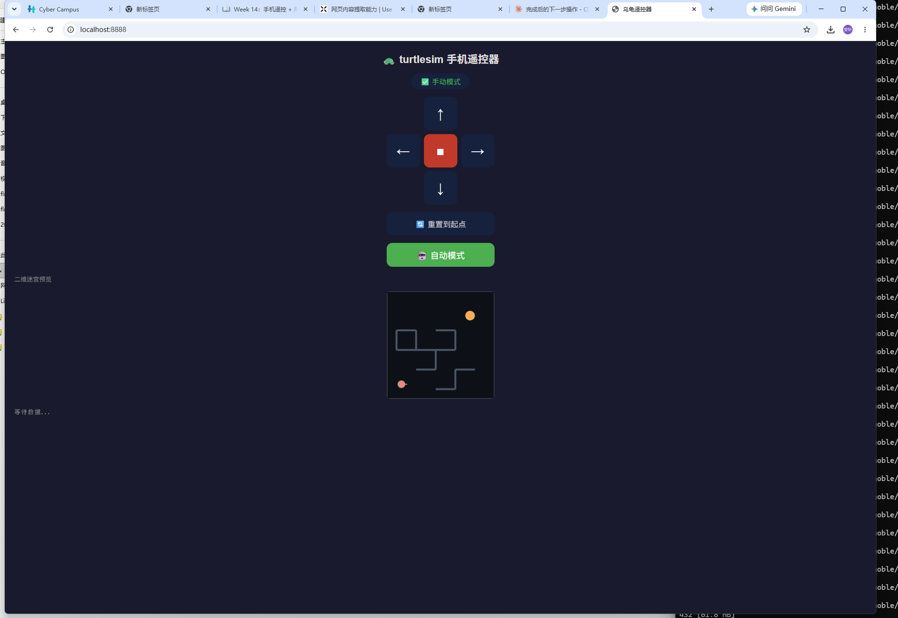
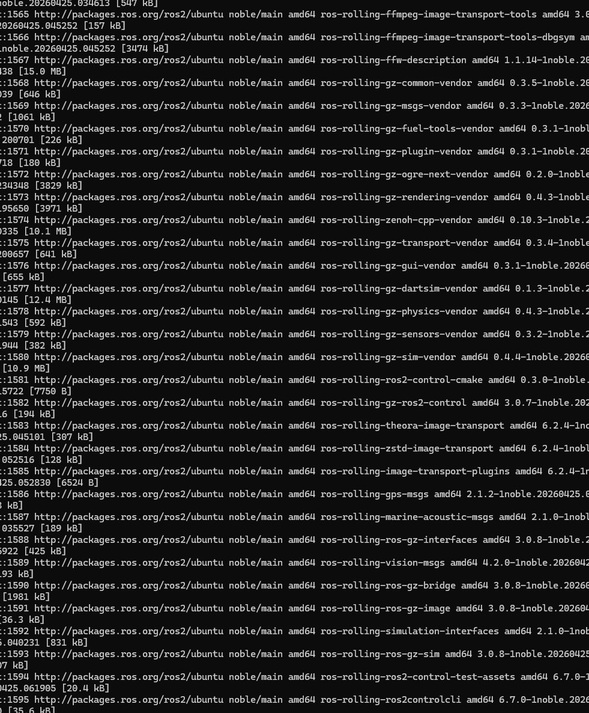

# 第14周课程总结报告

## 手机遥控机器人迷宫探索项目

### 一、课程目标

本周课程的核心目标是将前面课程中学习过的网页开发、网络通信、ROS2、机器人控制以及仿真技术整合起来，构建一个完整的机器人远程控制系统。

通过手机网页发送控制指令，利用 Tailscale 虚拟局域网进行通信，在 WSL 环境中的机器人仿真程序接收指令并控制机器人运动，实现机器人在迷宫中的探索任务。

整体控制链路如下：

> 手机网页 → Tailscale局域网 → WSL/ROS2仿真程序 → 机器人运动

本项目重点不在于学习新的算法，而是在于理解完整的机器人系统工程流程。

---

## 二、项目内容

课程提供两种实现方向供学生选择：

### 方向A：PyBullet 四足机器人迷宫探索

使用 PyBullet 物理仿真平台控制四足机器人（Laikago）。

主要功能：

* 手机网页遥控机器人
* 前进、后退、左转、右转
* 三维迷宫探索
* 撞墙检测
* 终点判定
* 自动探索（高级要求）

项目结构：

* server.py
* maze.py
* explorer.py
* index.html

特点：

* 三维效果真实
* 具有物理仿真效果
* 适合多人团队项目

---

### 方向B：ROS2 Turtlesim乌龟迷宫探索

利用 ROS2 和 turtlesim 实现二维迷宫导航。

主要功能：

* 手机网页控制乌龟运动
* ROS2话题通信
* 障碍物碰撞检测
* 自动探索迷宫
* 起点终点判定

项目结构：

* turtlesim_web_bridge.py
* explorer.py
* index.html

特点：

* 更符合真实ROS机器人开发流程
* 自动探索为必做内容
* 适合个人或双人项目

---

## 三、关键技术

### 1. Web网页控制

使用 HTML、JavaScript 和 WebSocket 开发手机遥控器网页。

实现功能：

* 前进按钮
* 后退按钮
* 左转按钮
* 右转按钮
* 停止按钮
* 自动模式切换

网页负责：

* 发送控制命令
* 显示机器人状态
* 显示迷宫信息

---

### 2. Tailscale虚拟局域网

由于校园网和WSL网络环境存在访问限制，因此采用 Tailscale 建立虚拟局域网。

作用：

* 手机与电脑处于同一虚拟网络
* 解决校园网隔离问题
* 解决WSL地址无法直接访问的问题

安装命令：

```bash
curl -fsSL https://tailscale.com/install.sh | sh
sudo service tailscaled start
sudo tailscale up
```

获取IP：

```bash
tailscale ip -4
```

手机通过：

```text
http://100.x.x.x:8080
```

访问控制页面。

---

### 3. WebSocket通信

采用 WebSocket 实现实时双向通信。

控制命令格式：

```json
{
  "type":"command",
  "move":1,
  "turn":0
}
```

特点：

* 延迟低
* 实时控制
* 支持状态回传

---

### 4. ROS2与机器人控制

方向B使用 ROS2 进行机器人控制。

主要内容：

* 发布速度指令

```bash
/turtle1/cmd_vel
```

* 订阅位姿信息

```bash
/turtle1/pose
```

实现：

* 运动控制
* 碰撞检测
* 状态监测

---

## 四、重要工程思想

本周最重要的工程原则是：

### 单一常驻程序原则

所有功能必须集成在同一个后台程序中。

正确结构：

```text
手机网页
    ↓
WebSocket
    ↓
桥接程序
    ↓
机器人控制
```

桥接程序同时负责：

* 网络监听
* 命令解析
* 机器人控制
* 状态反馈

禁止：

```text
程序A接收网络
    ↓
程序B控制机器人
```

这种方式会导致：

* 状态冲突
* 命令丢失
* 调试困难

---

## 五、自动探索算法

自动探索是本项目的重要扩展内容。

课程推荐方法：

### 右手法则

机器人始终沿右侧墙壁前进。

特点：

* 实现简单
* 能保证走出完美迷宫

---

### 左手法则

与右手法则相反。

特点：

* 逻辑简单
* 适用于多数迷宫

---

### BFS算法

广度优先搜索。

特点：

* 可找到最短路径
* 计算量较小

---

### A*算法

启发式搜索算法。

特点：

* 搜索效率高
* 实际应用广泛

---

## 六、项目完成过程

项目开发主要分为四个步骤：

### 第一步：打通控制链路

完成：

* Tailscale配置
* 仿真启动
* 手机访问网页
* 基本运动控制

---

### 第二步：设计迷宫

修改：

* maze.py
* OBSTACLES参数

实现：

* 更复杂地图
* 自定义障碍物

---

### 第三步：实现自动探索

修改：

* explorer.py

实现：

* 右手法则
* BFS
* A*等算法

---

### 第四步：成果展示

完成：

* 自动通关演示
* 运行视频录制
* 项目报告编写

---

## 七、项目收获

通过本周项目，我学习并掌握了：

### 技术方面

* ROS2机器人控制
* WebSocket实时通信
* Tailscale局域网搭建
* PyBullet仿真开发
* 自动寻路算法
* 前后端通信开发

### 工程方面

* 软件模块化设计
* 网络与机器人系统集成
* 项目分工协作
* 调试与测试方法

### 思维方面

理解了机器人系统开发并不仅仅是控制机器人运动，而是需要将：

* 网络通信
* 控制算法
* 用户界面
* 仿真环境

整合为一个完整系统。

---

## 八、总结

本周项目是整门课程的重要综合实践。通过搭建“手机网页—Tailscale局域网—ROS2/仿真程序—机器人”的完整控制链路，我们成功实现了机器人远程操控与迷宫探索任务。

项目不仅巩固了之前学习的ROS2、Python编程、网页开发和网络通信知识，还进一步培养了系统集成能力和工程实践能力。通过自动探索算法的实现，我们对机器人自主导航与智能决策有了更深入的理解，为后续机器人开发和人工智能应用学习打下了良好的基础。

