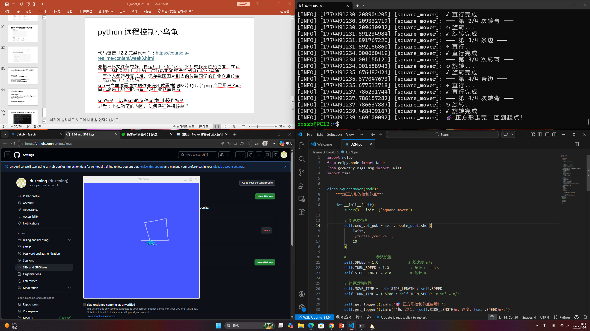

第二周进一步完善了开发环境与工具链的配置。首先，在 Ubuntu 环境中完成了 GitHub SSH 密钥的生成与配置，实现了通过命令行与远程仓库的安全交互，并掌握了基本的 Git 操作指令，如代码克隆（git clone）、添加文件（git add）、提交记录（git commit）以及推送到远程仓库（git push），能够完成基础的版本管理流程。

同时，完成了 VS Code 与 WSL Ubuntu 的连接配置，通过安装相关插件实现了在 Windows 环境下直接访问与编辑 Linux 子系统中的文件，提高了开发效率。在 ROS2 方面，成功运行 turtlesim 小乌龟节点，并通过命令行进行节点控制与交互。此外，还使用 Python 编写简单程序，实现了对小乌龟运动的控制

