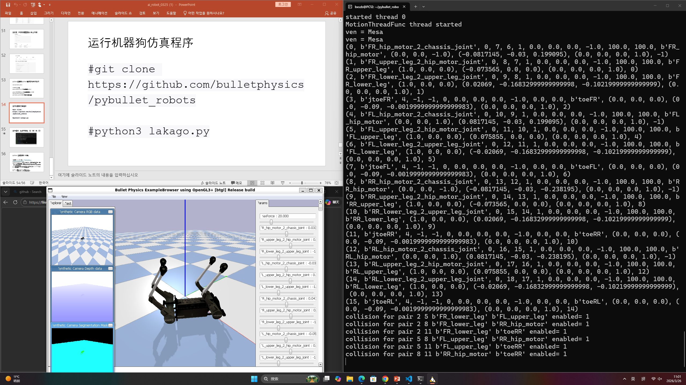
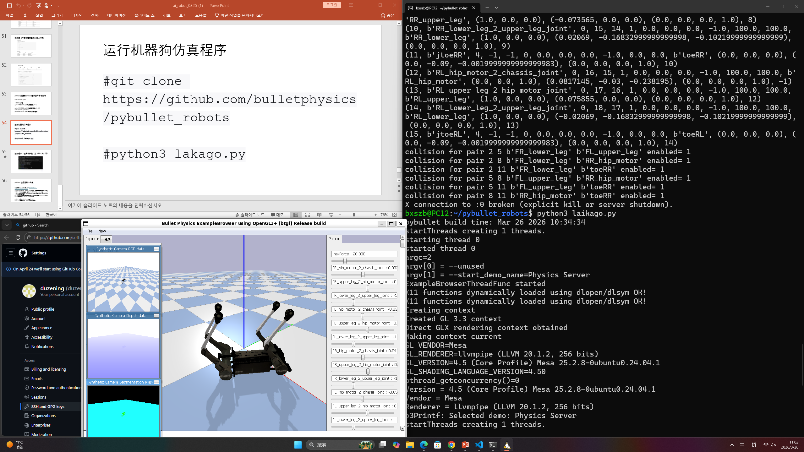

Week4

第四周主要学习计算机与机器人基础概念，包括命令行的本质、程序运行原理、网络通信（IP、SSH）以及 Linux 权限与目录结构等内容。同时介绍了 Git 与 GitHub 的原理，并完成 Python 环境配置及简单仿真实验（如机器狗仿真），提升对软件运行机制与机器人系统的整体理解。




下面是帮你整理好的 **Week 4 实验报告结构**（已保持和前面完全一致风格，并统一图片路径）👇

---

# Week 4：机器人运动学基础（二维）

## 实验内容

本周完成了以下任务：

1. 学习二维坐标系基本概念（世界坐标系、机器人坐标系）
2. 理解坐标变换原理
3. 掌握里程计（Odometry）基本原理
4. 学习ROS2中里程计数据获取方法
5. 进行Turtlesim运动学实验（位置与角度变化）
6. 掌握差速驱动机器人运动学公式
7. 编写节点读取机器人位置信息
8. 了解简单3D运动学仿真（PyBullet拓展）

---

## 实验截图

### 坐标系与位置示意


### Turtlesim位姿变化


### 里程计数据输出


---

## 运行命令

```bash
# 启动小乌龟
ros2 run turtlesim turtlesim_node

# 键盘控制
ros2 run turtlesim turtle_teleop_key

# 查看位姿（里程计）
ros2 topic echo /turtle1/pose

# 查看odom话题（真实机器人）
ros2 topic echo /odom

# 运行位置读取节点
python3 pose_reader.py
```

---

## 遇到的问题

1. **问题**：看不懂坐标变化
   **解决**：结合小乌龟运动观察 x、y、θ 的变化

2. **问题**：角度单位不理解
   **解决**：明确 θ 使用弧度（rad），90° ≈ 1.57 rad

3. **问题**：里程计数据复杂
   **解决**：重点关注 position 和 orientation

---

## 学习心得

本周重点学习了机器人运动学基础，理解了坐标系（世界坐标与机器人坐标）的区别以及里程计的作用。通过Turtlesim实验直观观察位置与角度变化，加深了对运动学公式的理解。同时掌握了ROS2中获取位姿数据的方法，为后续路径规划和导航打下基础。

---

## 返回

[← 返回首页](../)

---

# Week 4（拓展）：运动学与3D机器人理解

## 实验内容

本周拓展学习了以下内容：

1. 理解差速驱动机器人运动学模型
2. 掌握线速度与角速度计算关系
3. 学习位置更新公式（x, y, θ）
4. 使用 PyBullet 进行3D运动演示
5. 初步了解正运动学与逆运动学
6. 理解机器人自由度（DOF）概念

---

## 实验截图

### 运动学轨迹演示


### PyBullet机器人运动


### 机械臂运动示意


---

## 运行命令

```bash
# 运行PyBullet仿真
pip install pybullet
python3 pybullet_kinematics.py

# 运行里程计读取节点
python3 pose_reader.py
```

---

## 遇到的问题

1. **问题**：运动轨迹计算不准确
   **解决**：检查速度和时间参数计算是否正确

2. **问题**：无法理解正/逆运动学
   **解决**：通过机械臂示例（手臂运动）理解

3. **问题**：3D仿真不直观
   **解决**：多观察不同速度组合产生的轨迹变化

---

## 学习心得

通过本周拓展学习，我从简单的2D运动进一步理解了机器人运动学本质，包括速度分解和位置更新。同时接触了正运动学与逆运动学的概念，以及自由度的定义，对机器人运动控制有了更系统的认识，也为后续学习机械臂和3D控制打下基础。

---

## 返回

[← 返回首页](../)
