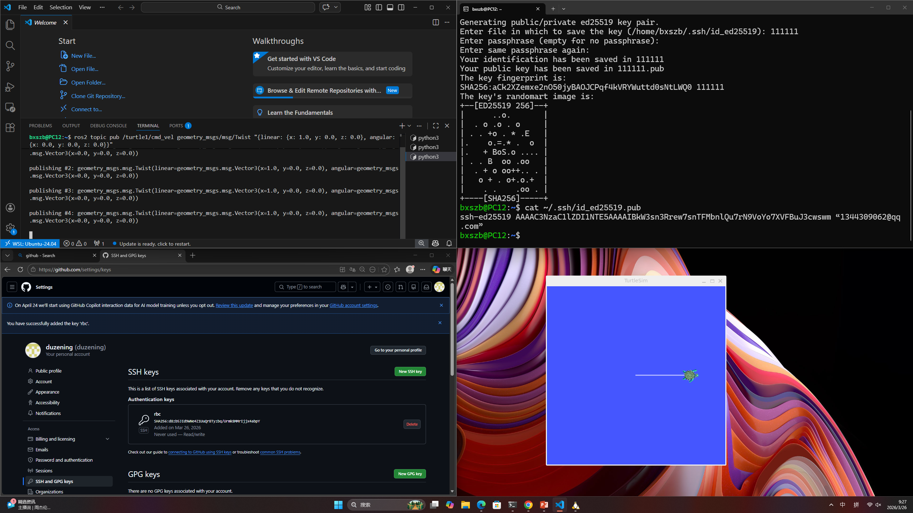

1.复习
2.markdown
3.期中考试(作业替代): 
         整理github 作业目录,提升可读性
         本周主要复习前半学期内容，包括 ROS2 基本命令、Python 节点编程、机器人运动学、传感器、RViz 和 PID 控制。

# ROS2 与机器人基础知识复习报告

## 一、本周学习内容

本周主要对前半学期所学习的机器人相关知识进行了系统复习，重点包括 ROS2 基本命令、Python 节点编程、机器人运动学、传感器应用、RViz 可视化以及 PID 控制等内容。

---

## 二、ROS2 常用命令复习

### 1. 启动 Turtlesim

```bash
ros2 run turtlesim turtlesim_node
```

用于启动 ROS2 自带的乌龟仿真环境。

### 2. 查看当前节点

```bash
ros2 node list
```

用于显示当前系统中正在运行的所有节点。

### 3. 查看话题

```bash
ros2 topic list
```

用于查看当前系统中的所有 Topic。

### 4. 监听乌龟位置信息

```bash
ros2 topic echo /turtle1/pose
```

实时输出乌龟的位置与姿态数据。

### 5. 发布速度控制指令

```bash
ros2 topic pub /turtle1/cmd_vel geometry_msgs/msg/Twist "{linear: {x: 1.0}, angular: {z: 0.0}}"
```

向乌龟发送速度指令，实现运动控制。

---

## 三、Python 节点编程练习

本周使用 Python 编写 ROS2 节点，实现控制 Turtlesim 中的小乌龟按照正方形轨迹运动。

运行程序：

```bash
python3 square_review.py
```

通过编写节点发布速度信息，使乌龟依次完成直线运动和转向动作，最终形成正方形轨迹。

---

## 四、机器人运动学计算

已知：

* 左轮速度：0.5 m/s
* 右轮速度：1.5 m/s
* 轮距：0.5 m

### 1. 线速度计算

公式：

[
v=\frac{v_r+v_l}{2}
]

代入数据：

[
v=\frac{1.5+0.5}{2}=1.0\ m/s
]

### 2. 角速度计算

公式：

[
\omega=\frac{v_r-v_l}{L}
]

代入数据：

[
\omega=\frac{1.5-0.5}{0.5}=2.0\ rad/s
]

计算结果：

* 线速度：1.0 m/s
* 角速度：2.0 rad/s

---

## 五、PID 控制复习

PID 控制器由比例（P）、积分（I）和微分（D）三部分组成。

### P（Proportional）

根据当前误差进行控制。

特点：

* 响应速度快
* 误差越大，输出越大

### I（Integral）

根据历史误差累积进行修正。

特点：

* 消除稳态误差
* 提高控制精度

### D（Derivative）

根据误差变化率进行调整。

特点：

* 预测误差变化趋势
* 减少超调和振荡

---

## 六、实验结果

### Python 程序运行截图

（此处插入实验运行截图）

### 小乌龟正方形运动结果截图

（此处插入运动轨迹截图）

---

## 七、学习总结

通过本周的复习，我重新梳理了 ROS2 的基础命令、Python 节点编程方法以及机器人运动学和 PID 控制等核心知识。通过实际操作 Turtlesim 仿真环境，加深了对 Topic 通信机制和机器人控制原理的理解。同时，通过运动学计算练习，进一步掌握了差速驱动机器人的速度分析方法。本次复习帮助我巩固了课程前半学期的重要内容，为后续学习机器人导航、SLAM 和自主控制等高级内容奠定了基础。
